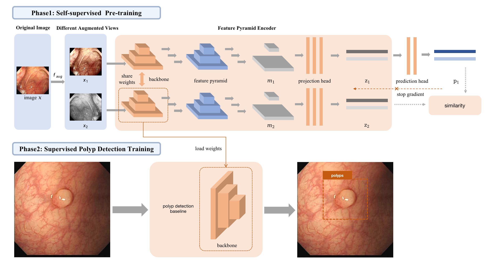
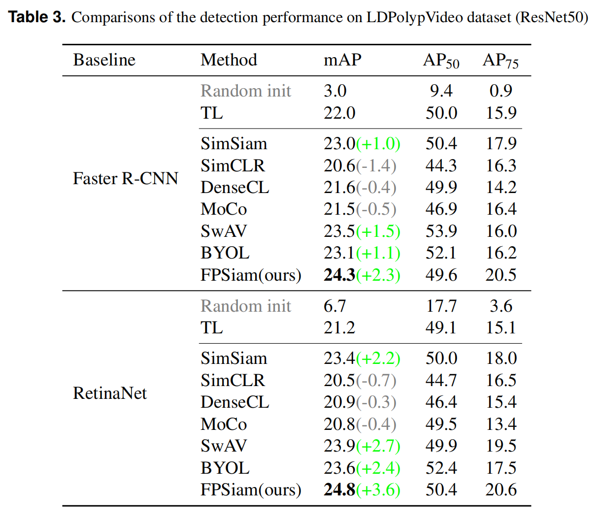
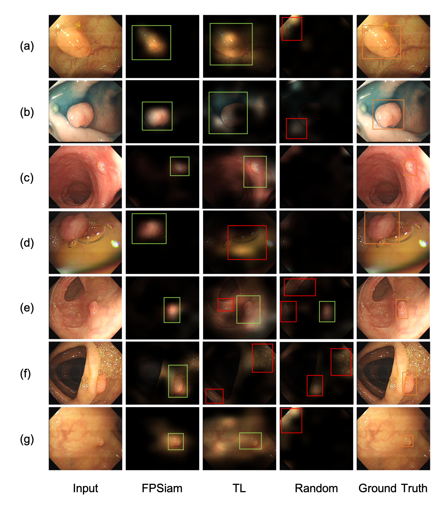

# Self-supervised representation learning using feature pyramid siamese networks for colorectal polyp detection



This repo is the PyTorch implementation of the method FPSiam, which is a novel SSL method customized for polyp detection tasks. We propose the feature pyramid
encoder module to leverage both global and local feature projections to pre-train highly discriminative representations. By bridging the gap between self-supervised pre-training and dense prediction tasks, FPSiam proves to be a promising solution for the polyp detection task. 


## Highlights
- **Boosting colorectal polyp detection:**  FPSiam pre-trained backbone largely benefits downstream polyp detection tasks compared with other state-of-the-art self-supervised learning methods and also surpasses the vanilla ImageNet transfer learning method (+2.3 and +3.6 mAP for two typical detectors).

- **Better grad-cam visualization:**  FPSiam can activate more accurate polyp regions in the attention maps to make precise bounding box predictions compared to the TL method.



## System Environment
- Intel(R) Xeon(R) Silver 4210R CPU @ 2.40GHz
- 256GB system memory
- 4 x NVIDIA Tesla A100 40GB GPU


## Installation
FPSiam depends on PyTorch, MMCV, MMSelfSup and MMDetection. 

Please refer to the [install_mmselfsup.md](https://github.com/open-mmlab/mmselfsup/blob/v0.10.1/docs/en/install.md) and [install_mmdetection.md](https://github.com/open-mmlab/mmdetection/blob/v2.26.0/docs/en/get_started.md/#Installation) for more detailed installation instructions.

Please first install them correctly and merge the code of this repo into corresponding folders.


## Usage

### Self-supervised Pre-training
    cd ${YOUR_WORK_DIR}/fpsiam/mmselfsup
    PORT=${YOUR_PORT} bash tools/dist_train.sh configs/fpsiam_resnet50_4xb64-coslr-200e_ldpolypvideo.py 4

### Extracting Backbone Weights
    cd ${YOUR_WORK_DIR}/fpsiam/mmselfsup
    python tools/model_converters/extract_backbone_weights.py ${CHECKPOINT} ${WEIGHT_FILE}

### Transferring to Downstream Polyp Detection
    cd ${YOUR_WORK_DIR}/fpsiam/mmdetection
    PORT=${YOUR_PORT} bash tools/dist_train.sh configs/ldpolypvideo/faster_rcnn_r50-fpsiam_fpn_1x_ldpolypvideo.py 4


### Tips
- After extracting the backbone weights, the model can be used to replace the original ImageNet pre-trained model as initialization for the downstream polyp detection tasks. 
- We use 4 GPUs and a total batchsize of 256 for training. If you use different, please also modify the initial **lr** parameter in the config. 


## Citations
Please consider citing our paper in your publications if the project helps your research. BibTeX reference is as follow.
```
```